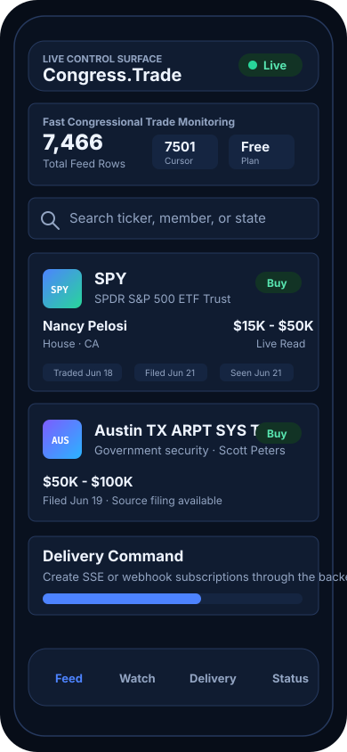

# Congress.Trade SwiftUI App

Native iPhone prototype for the same backend-owned `/api/client/v1` API used by
the PWA. The backend remains the source of truth; the phone is a control surface.



## Current Surface

- Feed dashboard using `GET /api/client/v1/bootstrap` and
  `GET /api/client/v1/feed?order=desc`.
- Trade detail sheet with source-filing deep link when `filing.sourceUrl` is
  present.
- Watchlist preferences through `POST /api/client/v1/commands` with
  `update_preferences`.
- SSE/webhook creation through `create_subscription`.
- Subscription pause/resume through `update_subscription`.
- Command status list through `GET /api/client/v1/commands`.
- Session token support through Keychain and `Authorization: Bearer <token>`.

## Open In Xcode

```bash
open clients/ios/CongressTrade.xcodeproj
```

Use the `CongressTrade` scheme and an iPhone simulator. The target is iOS 17+.

CLI build check:

```bash
xcodebuild \
  -project clients/ios/CongressTrade.xcodeproj \
  -scheme CongressTrade \
  -destination 'generic/platform=iOS Simulator' \
  CODE_SIGNING_ALLOWED=NO build
```

## Auth

The prototype can read the public feed without sign-in. Signed-in actions need an
opaque backend session token saved with:

```swift
try KeychainTokenStore().save("<session-token>")
```

The next production auth step is Sign in with Apple or a web-auth handoff that
returns the backend session token. Do not store provider keys, admin tokens,
scraper logic, calculations, or MCP orchestration in the app.

## API Override

By default the app uses:

```text
https://congress.trade/api/client/v1
```

For local Worker testing, set the `CONGRESS_TRADE_API_BASE_URL` environment
variable in the Xcode scheme, for example:

```text
http://127.0.0.1:8788/api/client/v1
```
